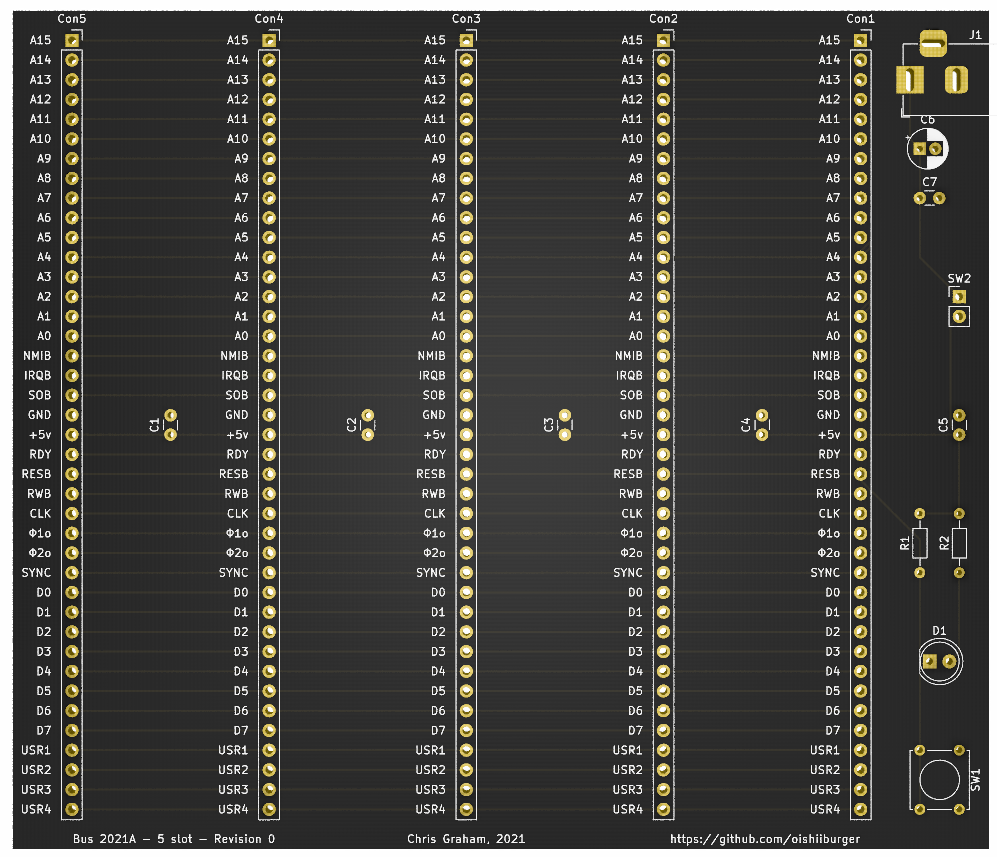
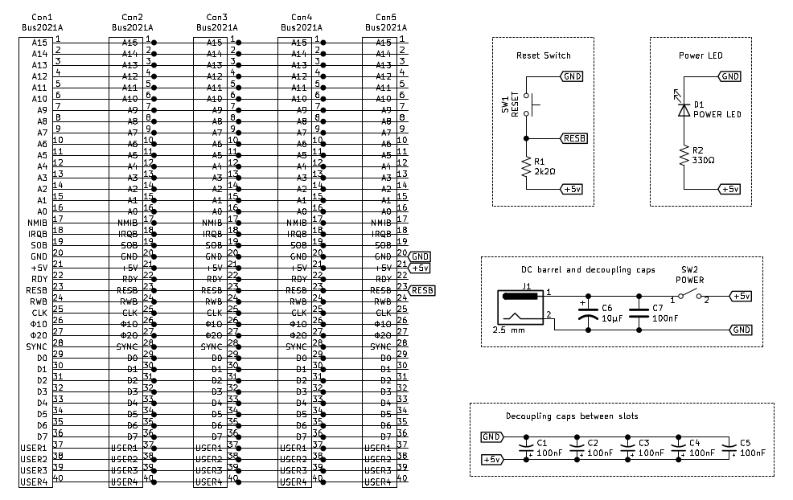

# Bus 2021A

This is a quick n' dirty bus design for a hobbyist computer system based around the [WD65C02](https://en.wikipedia.org/wiki/WDC_65C02). It is not meant to be fancy, but it should be functional. Features of the 65C02 which are unique to the WDC version are not exposed to the bus (i.e. VPB Vector-Pull Output, MLB Memory-Lock Output, and BE Bus Enable input). 4 pins (USER1 through USER4) are provided for peripheral expansion / experimentation / whatever.

The purpose of the bus is to allow for the use of a custom backplane so that several small boards to be easily connected. The backplane design is below, and protoboards intended for this bus are to come.

The bus mapping is [here](./Bus2021A.txt), but also printed on the backplane board.

## Bus 2021A backplane - 5 slot

All kicad files, gerber files, etc. are [in the repo](./Bus2021A_5Slot). 

The backplane features spots for 5 female pin headers, a DJ jack for 5v power and a power jumper (which can be broken out to a switch), a power LED, and a reset switch which is tied into the bus. 

A future revision might include blinkenlights on the backplane, but for now there will be space for those to be easily placed on one of the protoboards.

| PCB | Schematic |
| --- | --- |
|  |  |

## Bus 2021A Protoboard

The protoboard connects with the backplane using a 90-degree pin header. It is designed as an easy and straightforward platform to interface with the bus and features a total project grid of 30x40 (1200 solder points). It has power rails vertically on either side with ground also extending horizontally, and the bus overall extends into the first three rows from the bottom (effectively a stripboard), all to keep distances shorter for wiring. The project grid not counting the rails or bus extension is 912 solder points. The board is labeled front and back on both axes.

The overall layout is:

```
Rows 1-3    :   Bus extension
Rows 4-5    :   Connected vertically
Rows 7-30   :   Project space (between power rails)
```

The purpose of the vertical connection between rows 4 and 5 is for easy installation of blinkenlights on the board using individual LEDs and resistors or LED bar graphs and resistor arrays. These rows can also be used for arbitrary circut connections without having to solder and resolder multiple wires.

Gerbers / drill files are [here](./Bus2021A_Protoboard/rev0_gerber).